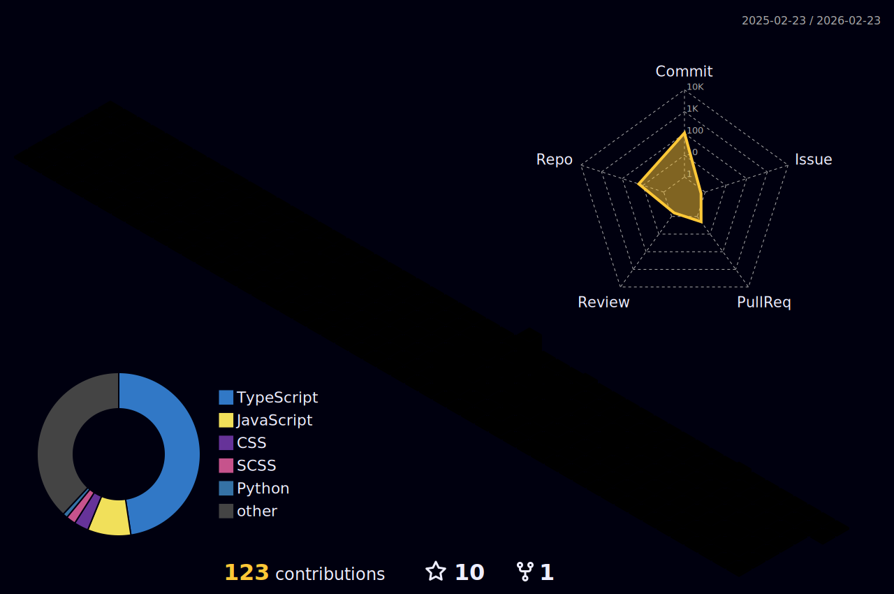

    

    

 

    
<h2>  Sobre mim </h2>

    
 Desenvolvedor Front-End e entusiasta de TI do Brasil, apaixonado por criar experiências digitais únicas. 

    
    <h3>   Um pouco mais de detalhe: </h3>
    <ul>
        <li><a>&nbsp; Tecnologia e Desenvolvimento de Softwares </a></li> 
        <li><a>&nbsp; Atuo com desenvolvimento web com HTML, CSS, JavaScript, Vue.js, Tailwind CSS, Angular, SQL e Firebase, além de integração com APIs. </a></li> 
        <li><a>&nbsp; Em constante crescimento pessoal, aprimorando habilidades em desenvolvimento web e boas práticas de código limpo. </a></li> 
        <li><a>&nbsp; Transformo ideias em experiências digitais, criando aplicações web funcionais, interativas e visualmente impactantes. </a></li> 
    </ul>
 

 

<h2> Tech Stack </h2>

 
    
    
    
    
    
    
    
    
    
    
    
    
    
    

 

<h2>  Profile Statistics </h2>

  

    
      
  

  

  
  

      
  

 <picture>
  <source media="(prefers-color-scheme: dark)" srcset="https://raw.githubusercontent.com/CaioVictor3/CaioVictor3/output/pacman-contribution-graph-dark.svg">
  <source media="(prefers-color-scheme: light)" srcset="https://raw.githubusercontent.com/CaioVictor3/CaioVictor3/output/pacman-contribution-graph.svg">
  
</picture>

 

<h2>  Calendário de Contribuições 3D </h2>

    

